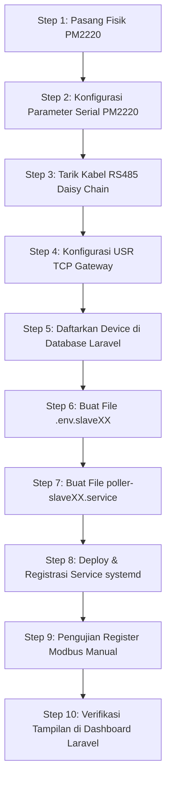

# SOP Penambahan & Commissioning Power Meter Baru (PM-XX)

Dokumen ini adalah Standard Operating Procedure (SOP) resmi untuk memandu proses penambahan dan commissioning unit Power Meter (PM) baru ke dalam sistem *Energy Tracker*.

---

## 1. Gambaran Arsitektur Sistem & Alur Data

Sistem *Energy Tracker* mengumpulkan telemetri konsumsi energi dari power meter industri menggunakan komunikasi serial Modbus RTU, dikonversi menjadi Modbus TCP melalui gateway, dan dikirimkan ke Laravel Backend via HTTP API.

```
+--------------------------------------------------+
|                  Laravel Server                  |
|          (Web Dashboard & Aggregations)          |
+--------------------------------------------------+
                         ▲
                         | HTTP POST (X-Device-Token)
                         |
+--------------------------------------------------+
|           modbus_poller.py Python Daemon         |
|      (Runs per slave instance via systemd)       |
+--------------------------------------------------+
                         ▲
                         | Modbus TCP (Port 502)
                         |
+--------------------------------------------------+
|               USR TCP Gateway                    |
|      (Converts Modbus TCP <-> Modbus RTU)       |
+--------------------------------------------------+
                         ▲
                         | RS485 (Daisy Chain)
                         |
+--------------------------------------------------+
|             PM2220 Power Meters                  |
|             (Slave 1, 2, ... 22)                 |
+--------------------------------------------------+
```

---

## 2. Standar Konfigurasi Fisik PM2220

Sebelum dipasang pada panel, konfigurasi parameter komunikasi pada unit PM2220 secara manual melalui display fisik meter:

*   **`COMM`** (Communication): **Enable** (Aktif)
*   **`ADDR`** (Modbus Slave ID): **Sesuai nomor meter** (unik per bus RS485)
*   **`BAUD`** (Baud Rate): **9600**
*   **`PARITY`** (Paritas): **None**
*   **`DATA BITS`**: **8**
*   **`STOP BITS`**: **1**

*Contoh Kasus:*
*   Power Meter 17 (HEAT TREATMENT) $\rightarrow$ Address/Slave ID: `17`
*   Power Meter 18 (KIMIA FITTING) $\rightarrow$ Address/Slave ID: `18`

---

## 3. Standar Konfigurasi USR TCP Gateway

Konfigurasi USR TCP Gateway harus disesuaikan melalui panel web (`http://<IP-Gateway>`) dengan kredensial default (`admin/admin`).

### A. Setting Serial Port (Menu: *Serial Port*)
| Parameter | Nilai Standar | Catatan |
| :--- | :--- | :--- |
| **Baud Rate** | `9600` | Harus sinkron dengan PM2220 |
| **Data Size** | `8` | Default |
| **Parity** | `None` | Harus sinkron dengan PM2220 |
| **Stop Bits** | `1` | Default |
| **Local Port** | `502` | Port standar Modbus TCP |
| **Work Mode** | `TCP Server` | Menunggu koneksi inbound dari Python poller |
| **Similar RFC2217**| **OFF** ❌ | **Wajib dinonaktifkan** |

### B. Setting Protokol (Menu: *Expand Function*)
*   **`Modbus Type`**: **`Modbus TCP/RTU`** 
    > [!IMPORTANT]
    > Opsi ini wajib dipilih agar gateway melakukan konversi format paket dari Modbus TCP (sisi server) ke Modbus RTU (sisi serial RS485). Jika diset `None` (Transparent Mode), telemetri akan gagal dengan error *Timeout*.

---

## 4. Standar Alokasi IP Gateway & Slave ID

Untuk menjaga kerapian jaringan produksi, alokasi IP gateway dan segmentasi Slave ID diatur sebagai berikut:

| Gateway IP | Port | Target Meter | Nama Area / Mesin | Slave ID |
| :--- | :--- | :--- | :--- | :--- |
| **10.88.8.16** | 502 | PM-03 | COR PASIR | 3 |
| | 502 | PM-04 | DUST COLLECTOR | 4 |
| | 502 | PM-05 | COMPRESSOR | 5 |
| **10.88.8.17** | 502 | PM-06 | HYDRAULIC PUMP | 6 |
| **10.88.8.18** | 502 | PM-17 | HEAT TREATMENT | 17 |
| | 502 | PM-18 | KIMIA FITTING | 18 |

---

## 5. Langkah-Langkah Penambahan Meter Baru

Ikuti urutan langkah wajib berikut untuk menjamin integritas data dan meminimalkan resiko *down-time*:



### Penjelasan Detil Langkah 5 (Registrasi Database):
Daftarkan `Machine` dan `Device` melalui admin panel atau seeding script. Pastikan:
*   `devices.slave_id` unik dan sesuai dengan setting PM2220.
*   `devices.api_token` digenerate secara acak dan aman.
*   `devices.status` diset ke `1` (Active).

---

## 6. Template Konfigurasi `.env.slaveXX`

Buat berkas `.env.slaveXX` di direktori root aplikasi `/srv/docker/apps/energy-tracker/` menggunakan template berikut:

```env
MODBUS_IP=<IP_GATEWAY_METER_INI>
MODBUS_PORT=502
MODBUS_SLAVE_ID=<SLAVE_ID_METER_INI>
REPORT_AS_SLAVE_ID=<SLAVE_ID_METER_INI>
METER_BOOT_ID=PM<SLAVE_ID>-<YYYYMMDD_COMMISSIONING>
DEBUG_RAW_REGISTERS=false
MODBUS_API_URL=http://10.88.8.46:6006/api/readings
DEVICE_TOKEN=<TOKEN_UNIK_DARI_DATABASE>
POLLING_INTERVAL=60
MODBUS_FRAMER=socket
STARTUP_DELAY=<DELAY_BERTINGKAT_6_12_18_dst>
INTER_REG_DELAY=0.5
```

---

## 7. Template Systemd Service (`poller-slaveXX.service`)

Buat berkas unit service di `/etc/systemd/system/poller-slaveXX.service` menggunakan template berikut:

```ini
[Unit]
Description=Modbus TCP Poller for Furnace (Slave <SLAVE_ID>)
After=network.target

[Service]
Type=simple
User=root
WorkingDirectory=/srv/docker/apps/energy-tracker
EnvironmentFile=/srv/docker/apps/energy-tracker/.env.slave<SLAVE_ID>
ExecStart=/usr/bin/python3 /srv/docker/apps/energy-tracker/modbus_poller.py
Restart=always
RestartSec=5
StandardOutput=append:/var/log/poller-slave<SLAVE_ID>.log
StandardError=append:/var/log/poller-slave<SLAVE_ID>.log

[Install]
WantedBy=multi-user.target
```

---

## 8. Panduan & Perintah Verifikasi (SSH)

Gunakan serangkaian perintah berikut untuk memvalidasi setiap tahapan integrasi:

### A. Verifikasi Jaringan & Port Gateway
```bash
# 1. Ping Gateway untuk mematikan latensi dan loss rate minimal
ping -c 4 10.88.8.18

# 2. Periksa apakah port Modbus TCP terbuka
nc -zv -w 3 10.88.8.18 502
```

### B. Uji Modbus Manual (Pymodbus Dry-Run)
Jalankan perintah interaktif Python berikut untuk memverifikasi pembacaan register langsung dari server tanpa menjalankan daemon poller:
```bash
python3 -c "
import sys, struct, time
from pymodbus.client import ModbusTcpClient

# Connect to target gateway
client = ModbusTcpClient('10.88.8.18', port=502, timeout=3)
if client.connect():
    # Read register 3059 (Active Power kW) for Slave 17
    r = client.read_holding_registers(address=3059, count=2, device_id=17)
    if not r.isError():
        raw = struct.pack('>HH', r.registers[0], r.registers[1])
        val = struct.unpack('>f', raw)[0]
        print('Modbus Read SUCCESS. Value Power (kW):', val)
    else:
        print('Modbus Read FAILED:', r)
    client.close()
else:
    print('Connection to Gateway FAILED')
"
```

### C. Verifikasi Status Service & Log Daemon
```bash
# 1. Cek status daemon poller systemd
sudo systemctl status poller-slave17.service

# 2. Pantau log aktivitas poller secara real-time
tail -f /var/log/poller-slave17.log
```

---

## 9. Acceptance Checklist

Perangkat baru hanya boleh dinyatakan **ONLINE** jika memenuhi seluruh kriteria berikut:

- [ ] **Koneksi Jaringan**: Ping ke Gateway sukses (0% packet loss, latency < 20ms).
- [ ] **Port Terbuka**: `nc -zv` pada port 502 mengembalikan status `succeeded`.
- [ ] **Modbus OK**: Perintah uji manual Python berhasil membaca register `3059` dan menampilkan nilai numerik yang valid (bukan NaN atau Error).
- [ ] **Daemon Running**: Status service systemd aktif (`active (running)`) tanpa ada riwayat crash loop.
- [ ] **API Ingestion**: File `/var/log/poller-slaveXX.log` menampilkan status respons HTTP `200 OK` atau `201 Created` dari API Laravel.
- [ ] **Tampilan Dashboard**: Meter baru muncul di sidebar dashboard utama Laravel, grafik mulai terisi data telemetri, dan menu tagging fase operasi dapat diakses secara normal.
